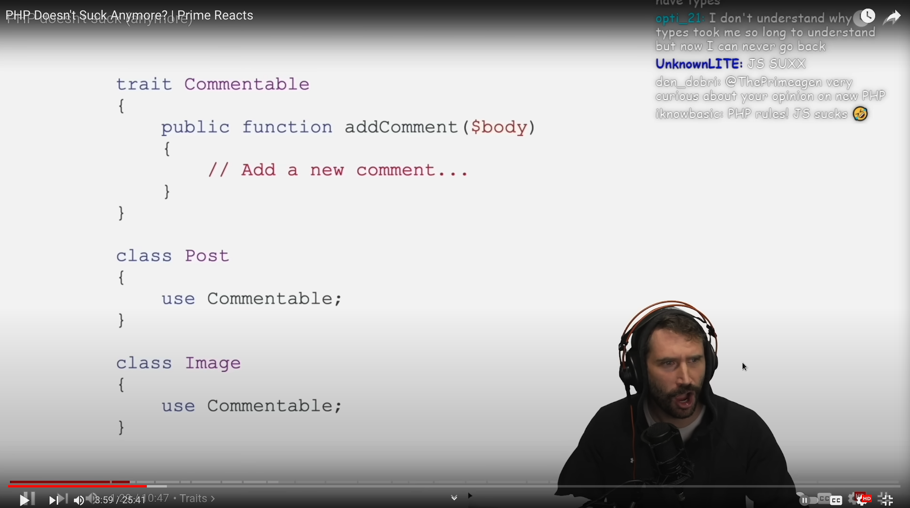

In my experience, DevSecOps best describes what I've done. Although I prefer Lead Security Software Engineer (Good luck finding a description that can be understood by HR). But when I mention in a conversation that I developed server security software in PHP, everyone is surprised.

- Have you lost your mind? PHP is not secure. Slow. You can write shitty code in it.

And that's the end of the conversation. (Unfortunately, this usually happens in interviews.)

- Why didn't you write it in Python or Go?

Absolutely valid points. But when YouTube accidentally suggested this video and I saw this reaction, I had to rethink my attitude.

Source: [PHP Doesn't Suck Anymore? | Prime Reacts](https://youtu.be/WsnHWxO7Krw?si=Um836Ej1P7FuSyKU)

Original video: [PHP doesn't suck (anymore)](https://youtu.be/ZRV3pBuPxEQ?si=kJvJOAWX5siIGvuJ)

## Why PHP?

Let's start at the beginning. Why PHP? The answer is simple. I wasn't the one starting the project.

We needed a couple of developers who could code. And we needed a server-side script language that could be easily run. The software is designed to solve shared hosting server problems. And what do shared hosting system admins see every day? PHP code.

Sure, there is Bash and Python is available on every Linux server. But what do you read day in and day out trying to figure out how the heck the server got hacked again? The client's site? PHP.

But why didn't we switch to a faster, safer language later? I'll write this down as well.

There was another reason the code was in PHP. Many have since forgotten this. How do you trust the "security" software of an unknown small company?

- You Google when it was founded. Oh, not even a year old. (I do not install)
- You look after it on social media. Oh, there are no reviews yet. (I do not install)
- They keep spamming us with their reports. Now I'm wondering what the hell they're selling. How can I view the code? Yep, it's just plain PHP. (I do not install)
- Well, these reports are really annoying. Let's read what they really do. Wait a minute. Is this really an actual security software running on multiple threads, modular, monitoring multiple things? Which shares the attack information almost realtime with the defended servers? I do not believe it! (I'll have to try it...)

## PHP code is not secure

I always raise my eyebrows when I hear this statement. Why do you think it not safe?
- There are no classes in it.
- Full of XSS, SQL injection. Etc.
- There are no types.

When was the last time you looked at an actual PHP project? Which wasn't a Wordpress plugin? (But they have already made great progress there as well.) What they usually think of are the HTML, CSS, JavaScript, PHP monstrosities taught in bootcamps or created by beginner developers. Which are all in one 20,000-200,000 line monster file. They really aren't safe. But not because of the language. But because of the inexperience of the developer.

The same mistakes are present in any language. You can still make an XSS error if you don't validate the input or format the output as HTML safe, in Java, C#, Go, Python. If you don't use prepared statements, you will have a SQL injection vulnerability.

But have you ever had to write a Buffer overflow exploit? Or perhaps a format string exploit? These are not present in the language, because they are handled at the language level.

You will be surprised about the types if you watch the video.

## PHP is slow

When I hear that PHP is slow, I just nod slowly. Well, yes, in PHP 5.6, the language was really slow. But how could it be accelerated? Let's say you changed web server? Yes. PHP code is usually served by a web server. It's just that the web server itself is not able to handle requests fast enough.

But the code we wrote ran on the server. It was not connected in any way to the web server on the server. So we had no such limitation. But this raised another interesting question. Do we need a PHP plugin for web services? No. So what if we don't use them? In fact, we shouldn't even load them?

What do you need for this? A custom PHP runner must be created where these plugins are not included in the created binary. Only what is absolutely necessary to run PHP-CGI. And imagine if you don't load unnecessary modules into your program. Would you think it would be faster? Much more faster.

- But compared to what will, it be faster? Certainly not Python!

I did a benchmark a long time ago. But I have to disappoint you. In terms of string processing, Python 3.x moves at a similar speed as PHP 5.6. How can this be improved? You use Python C bindings. Which essentially transfers the operation of the Python code to a faster plugin written in C.

What do you need for this? You nned to install Phyton 3 first. Because most operating systems don't have it by default. Then you have to build a C binary locally on the server with the C compiler located on the server. (Wondering why it's not good to work with Python on Alpine? That's why.)

So I need to install a package. In which extensions are written in C to speed up processing. Just wait a second. This can also be achieved in PHP. Because anyone has the opportunity to write PHP plugins, extensions in C, C++. And PHP 7.3 was already about 8x faster compared to its Python counterpart.

And if I tell you that after installing the `php_aho_corasick` module, we achieved a 7000% speedup in text recognition, even after that. I think you won't believe me. (I did not make a mistake. The improvement was 7000%.) But I was the one who started porting the extension from 5.6 to PHP 7.2. See [https://github.com/ph4r05/php_aho_corasick/pull/5](https://github.com/ph4r05/php_aho_corasick/pull/5). (Sorry guys about I couldn't do more to help your work.)

So why didn't we write it in C? Have you ever tried to solve an edgecase on a remote server? Where you don't have other permissions than SSH and nano? A dynamic language was needed.

## PHP does not have good security solutions

For quite some time I have been trying to get into the development of a security software that uses Go. There is a reason for this. But when we start talking about security technology, acronyms immediately come up. Have you ever dealt with application security?

- Sure I did!
- What SAST, DAST, XYZ did you use?

What they mean is this figure from the OWASP DevSecOps Guideline:

Source: https://owasp.org/www-project-devsecops-guideline/latest/

Oh, I know this figure. I have tried many tools on it and other alternatives as well. But to be honest, I haven't found anything better than the free extensions that can be installed with php composer. And imagine. They can also be run locally. I don't need to subscribe to a SaaS solution just to write secure code.

The annoying thing about the whole thing is when I finally get into the project and see that not only is the full DevSecOps pipeline not implemented, but not even a basic Linter is set up. And the interview was about whether I had already used SonarQube and Snyk, or had I set up ZAProxy.

What kind of security expectations do you think we had if our software was installed on potentially hacked to root servers. And nothing else helped? In addition, all supported distributions had to work the same way.

- Why don't you have used Cloud? They have already solved these problems there.

I have to disappoint you. There are also only Linux servers on the cloud. They have deployed our software on AWS, Azure, GCP, Linode, etc. And guess what. Malware hits and blocked incidents also came from there.

The Cloud provides a solution for only one thing. For scalability. But mostly for their own scalability.

## Pipeline

Let's start at the beginning. Where does the DevSecOps pipeline start? Locally. A developer sits down in front of his computer and starts tinkering with something. There is no commit, no collaboration, nothing. A developer sat down in front of the machine and works. If you are done with your task, you would like to publish it.

Do You need git? Not necessarily. It is enough to upload the code to a server. Let's say in a zip. (Thanks AWS for still having this bullshit...)

But if several of us want to work together on the code, we have to figure out how to do it. So why not use a version tracker? This could be git. Git's job is to help people edit text files together. No more, no less. But what goes in and what happens with the changes is a completely different question.

There is nothing more annoying than when someone commits code to master on Friday night that is missing a semicolon. Then at dawn the phone rings that the site needs to be fixed because customers are complaining. That's what Lint is for. It can be installed with composer. Let's say `composer require --dev overtrue/phplint'. Then I can check from the command line that there are no language errors in my code. No more Friday night phone calls.

But wait! Composer? That is, can I manage packages and simply download them? Yes it can be. Package information is available in `composer.json`. What You can check with, say, Trivy, Dependabot, there used to be a security checker that could be installed with composer. But as I read now, the `composer update --audit' switch is also available.

Two things we say in security. Update your software. And check regularly that there are no vulnerabilities. This is also ticked with one command.

But if we can use composer, we can also install other add-ons that make our work easier. These can be accessed from the autoloader. And with this, we can get to know the PSR-4 standard. At a standard level, it is defined how I can split code into multiple folders.

I don't know where to put my additional scripts? In the utils folder, in the scripts folder? How can I refer to them? It can drive me crazy when I have to research how individual files are connected in an unknown code base.

But when it comes to standards. PRS-2? How do we format our code? Should we use spaces or tabs now? The brace should be at the end of the line or on a new line. Do I need brackets? It is handled by a standard. And, even better, we can fix the formatting of the code according to the standard by running a command.

But if talk about code quality control. Where are the tests? Code cannot be secure without tests. Using Composer, we can install PHPUnit and write tests.

If we want something good for ourselves, we can solve the code quality control with a combined tool. Let's say phpqa. `composer require --dev edgedesign/phpqa`. Then, by running one command, we can generate beautiful, transparent, searchable HTML reports from it locally. How much is my code smell now? Oh, I see.

Because it is not enough to know how much the code quality has changed. If shit doesn't change, it's still shit. (Yes I mean you SonarQube)

But there are testing tasks that cannot be performed with Unit tests. So how about using it for something more serious? Let's say Codeception? `composer requires codeception/codeception`. This is a BDD framework. And we can even write cucumber tests in it.

Everything I have described so far works locally. No subscription required. No need for a pipeline. Just run one command in the commandline. The problem starts with the fact that not everyone remembers to run these commands. `git pre-commit hook` is a good solution for this. You are not allowed commit until the commands run successfully. And again, you still don't need a pipeline.

The problem is when, despite these, someone is not willing to use the tools. This is what a git pipeline is for. It doesn't matter who is stubborn. How fast do you want to go. The pipeline runs after every push. (Or before merging, but this now a branching strategy).

- This does not contain DAST.

What do you think what the Selenium test is? And in Codeception, there is a Selenium test driver. But of course, we can try to spin up a ZAP or other crawler, which fuzzing the application. But this requires more complex testing. It might be worth running on a build server. But this is no longer a PHP specific problem.

How much do you think I know about testing if I created an Asyncron FakeApi fuzzing module for PHP Codeception? See [module-fake-api](https://github.com/LeeShan87/module-fake-api)

It is not for nothing that I say that we should not talk about DevSecOps best practices if the code that should be monitored has 0% test coverage. For me, this is the most important metric. If there is not at least 80% coverage, don't even think about DAST. What do you do when it finds something? And it will. This is also the case with PenTest. What do you do with a report if they find something? And they will.

The entire pipeline ends on the live production server. But again, this is not a PHP specific problem.

## There are things that cannot be solved in PHP

Yeah I know. Many things cannot be solved with PHP. There are better and more optimal solutions. But in this case PHP was only the manager code.

Do you need low level speed optimization? PHP module solves most of the cases.

But I've written PAF in PHP before. You read it write. PAF. This means Protocol Application Firewall. On an average server, not only HTTP ports are open (Unfortunately). So this resulted in some pretty interesting catches. We detected the WannaCry virus months earlier, but we didn't have enough human resources to go after it. (Sorry world.)

But PAF most used function was serving HTTP requests. The PHP language was not able to serve this amount of requests. Therefore, it was necessary to replace the code with a more efficient solution. Which could be anything but ModSecurity.

## The problem of the 1%

I really enjoyed working on this project, but unfortunately we got to the 1% problem. And unfortunately, that's what keeps me from using PHP again to build security software of this magnitude.

It is not possible to satisfy all the needs of every client in 1 package. First of all, there aren't that many people who can do this. The other is that not all customers have the same problems. This can only be solved with microservice architecture. And no. You cannot install Kubernetes on a customer's server. Neither Docker. Nothing more serious than a couple of binaries. You do not have the right to do so, as you do not manage the servers.

In other words, you need something that is OS independent. Binaries can be made quickly. It can be released independently. It's easy to learn. And that is Go.

Why do you think Kubernetes was written in Go? Just because of this problem.

The funny thing is that PHP was not the limitation. What do you think was necessary for this project?
- Programming languages: PHP, Bash, Python, Ruby, C, C++, Javascript, Lua
- Operating systems: Ubuntu, Debian, Centos, CloudLinux, Kali, OpenSuse, etc. (Nooooo Windows. I also have my limits.)
- Security tools: ModSecurity, Auditd, Osquery, everything that is a proxy, BurpSuite, Yara, netfilter (I didn't write Iptables on purpose), honeypots, etc. (Sorry, I can't remember them all.)
- Virtualization: Docker, Kubernetes, Docker Swarm, Virtualbox, Level 1 and 2 hypervisors.
- Cloud: Where you can run Linux...
- Build tools: Docker (yes, it can also be used for binary building), chroot, fpm, rpmbuild, aptly
- Repo tools: Artifactory, Nexus, Docker image repos.
- Pipelines: Jenkins, BitBucket, Github
- Security techniques: Reverse Enginering, Malware analysis, Incident analysis and mitigation, writing WAF rules.
- Configmanagers: Ansible, SaltStack, Chef
- Interprocess communication: System-V, shared memory, X-MQ (pub-sub, don't make it fancy), protobuf, API, RestAPI (what do you think this would be but communication between 2 processes?)

And I'm tired of listing it again. So is it possible to write effective server security software in PHP? Yes it can be. But don't be surprised that everything else is also needed.

- How scalable is this solution?

When I left the project, it was protecting 7,000 servers and millions of websites around the world. But it could have handle much more than that. It was just a matter of getting and keeping customers.

## Mental health

How does this relate to mental health? Do you think the human brain can remember so much? Have you ever been responsible for millions of websites? Have you ever woken up to the fact that more than 200 servers have stopped and hundreds of thousands of pages are not working?

Don't be surprised that I was burned out. Nor that I forget things. Or that it takes a long time to recall things. If possible, do not use acronyms in interviews. They can mean many things. And if someone didn't recall a tool, it's not certain that they didn't use a similar one. Don't humiliate the other just because they don't know XYZ.

## Call To Action?

I’ve been thinking a lot about an impactful call to action section. The results? Well, basically, I’ve been constantly looking at various statistics, emails, and social network sites.

So, if you liked what I wrote, please:

- DO NOT clap me!
- DO NOT hit a like!
- DO NOT share it!
- DO NOT want to talk to me on Calendly: [https://calendly.com/zoltantoma87/one-on-one](https://calendly.com/zoltantoma87/one-on-one), I can only handle one person per day for up to an hour.
- DO NOT add me as a friend on LinkedIn: [https://www.linkedin.com/in/toma-zoltan/](https://www.linkedin.com/in/toma-zoltan/)
- DO NOT support me on Patreon: [https://www.patreon.com/CuriousMindsCollective](https://www.patreon.com/CuriousMindsCollective)
- DO NOT want to work with me! I have unrealistic ideas about working together: [https://medium.com/@zoltantoma/how-much-should-i-charge-for-my-service-b2c8b380e66e](https://medium.com/@zoltantoma/how-much-should-i-charge-for-my-service-b2c8b380e66e)

And DO NOT! I repeat, DO NOT follow my work. It would only feed my own Ego while I am working on the #MentalInCyber topic and trying to convey the (cyber) security-first business model.
