Ma úgy gondoltam, hogy felveszek két videót. Úgy mond az első kisérletnek, hogy többnyelvűsítsem a tartalmamat. Leültem és elkezdtem megfogalmazni, hogy mit is szeretnék mondani.

Hogy miért van ez hamarosan elérhető. Annyi, hogy ez kapcsolódik a #mentalInCyber témájához. Ez egy kísérlet arra, hogy már meglévő "gátlásokat", "Proxykat" tudjak kiváltani, kicserélni, vagy javítani. Hogy sikerül e? Az egy teljesen más kérdés.

Egy gondolattal ráztam az írásomat, amit Édes Apámtól tanultam.

"A munkához mindig úgy kell állni, hogy más is hozzáférjen"

## Most mi van?

Leírtam a gondolataimat és eszembe jutott, és most mit kezdjek vele? Nem is lett rossz. Ezt lehetne publikálni is akár. Egy kis szösszenet a mentál egészséggel kapcsolatban. Csak le kellene fordítani angolra.

Na de várj csak. Pont a többnyelvűsítésről szolt. Akkor miért akarnám ismét az archív mappába rakni a magyar változatott? Mi lenne, ha helyette menne ebben a nyers formában már a publikált oldal tartalmához?

Ja persze... az oldal maga még nem több nyelvű. És én még magyarul sem tudok helyesen írni, nem hogy angolul. Hungrist beszélek.

Na várjunk csak. Kifejezetten olyan témát választottam az oldalhoz ami támogatja a több nyelvet. És a Hugo alapból sokat tett a többnyelvű tartalmak generálása érdekében. Akkor, hogy a fenébe kellene ezt beállítani?

## Több nyelvűség problémája

Ha már picit is foglalkoztál online tartalmakkal. Vagy ha netalántán fejlesztő vagy ismered az érzést. "Szopjon ezzel az, akinek két anyja van". Szerencsére nem nulláról akarom ezt elérni. És elméletileg pofon egyszerű ennek a beállítása. (Az arcom már sajog ennyi pofontól)

De talán találtam rá egy működő megoldást, amit most szeretnék veletek megosztani.

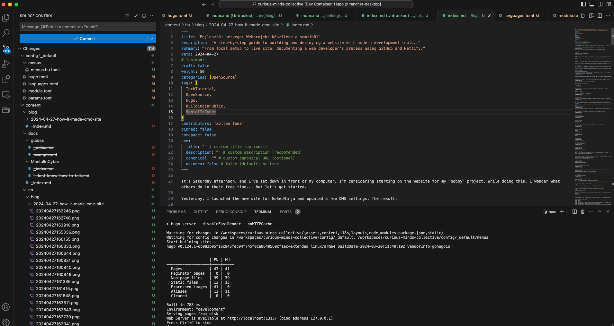

## Olvasd a dokumentációt

Mi az első dolgunk, mint fejlesztő? Persze, hogy olvassuk a dokumentációt. Én a Doks témát választottam a Hyas-től. És milyen jó, hogy van dokumentációs oldaluk és van róla bejegyzés, hogyan lehet beállítani a több nyelvűséget. Meg is mutatom nektek.

Őőőm... ez nem túl nagy segítség. Todo írni neki, erről a postról. (Persze finomabban, és több hasznos lépéssel.)

Az eredmény: bukta? Nem. Mivel open-source a projekt. Van GitHub issue trackerük.

Próbáljuk meg az i18n-t. [Github issue search](https://github.com/gethyas/doks/issues?q=is%3Aissue+i18n+is%3Aclosed)

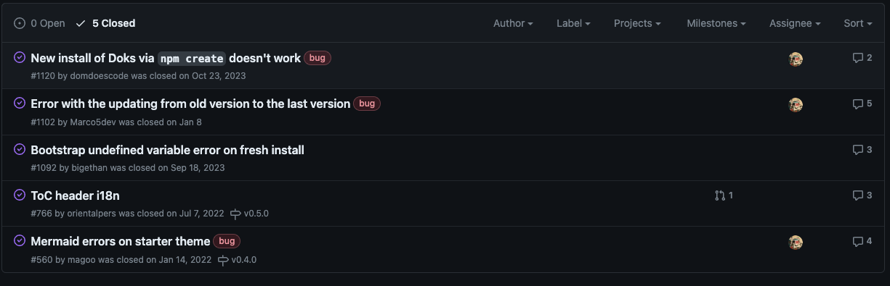

Nem sok eredmény. Viszont a leírásokban találunk pár segítséget. Így eljutottam ehhez az issue-hoz.

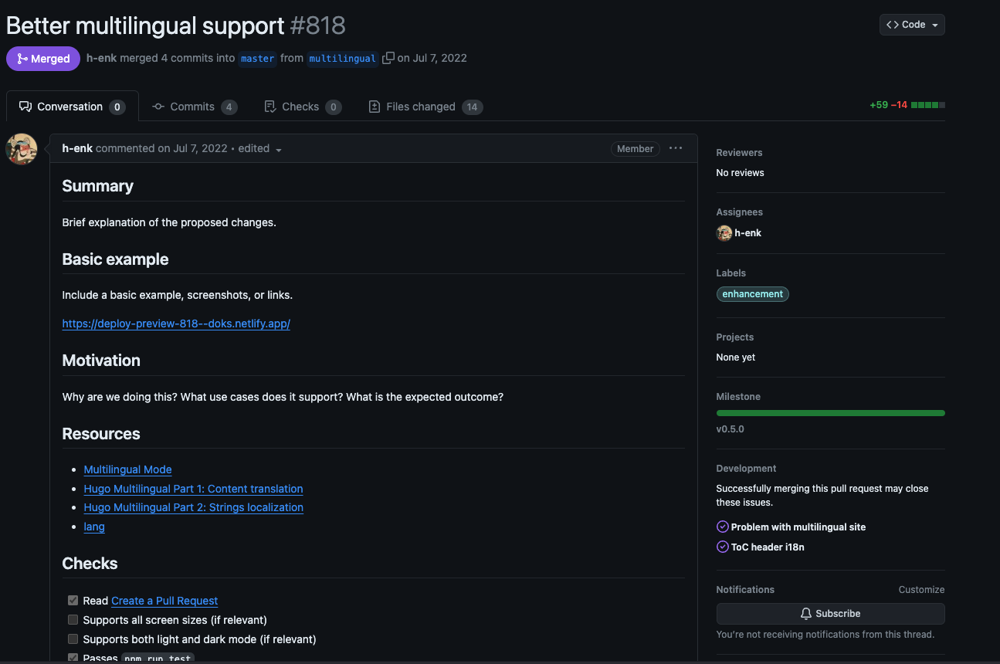

[Better multilingual support #818](https://github.com/gethyas/doks/pull/818)

Szóval volt már ebben a témában kész feladat. Akkor hogyan is állnak vele?

Azért itt hagyom a hasznos linkeket az issueból. :)

## Resources

- [Multilingual Mode](https://gohugo.io/content-management/multilingual/)
- [Hugo Multilingual Part 1: Content translation](https://www.regisphilibert.com/blog/2018/08/hugo-multilingual-part-1-managing-content-translation/)
- [Hugo Multilingual Part 2: Strings localization](https://www.regisphilibert.com/blog/2018/08/hugo-multilingual-part-2-i18n-string-localization/)
- [lang](https://developer.mozilla.org/en-US/docs/Web/HTML/Global_attributes/lang)

## Lépések amiket változtattam

Hogy több nyelvűséget támogassunk változtatni kell a Hugo oldal generátor beállításain. Elsőnek be kellett állítani, hogy több nyelvet szeretnék.

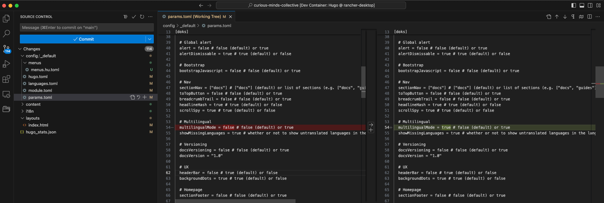

Én azt szeretném, hogy egyszerűen el lehessen választani a különbőző nyelveket. Így mindet szeretnék külön nyelv specifikus mappába rakni.

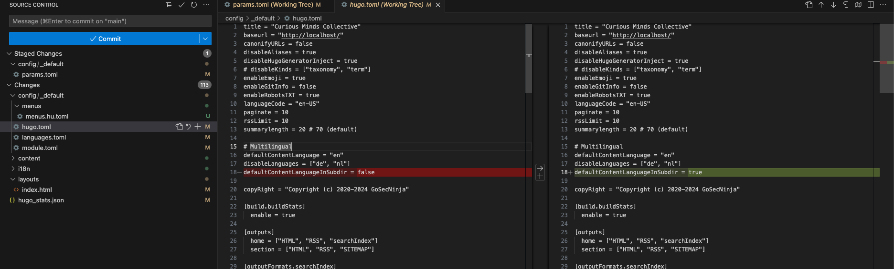

Szeretnék magyar nyelvet. Vagyis a menűknek magyar szerűnek kellene lennie. Legalábbis a linkek jó lenne ha oda mutatnának. Ehhez másoltam az angol beállítást és átneveztem magyarra.

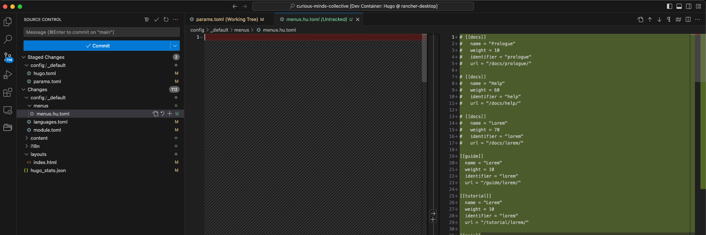

A kód generátornak tudni kell, hogy van magyar nyelv is valahol.

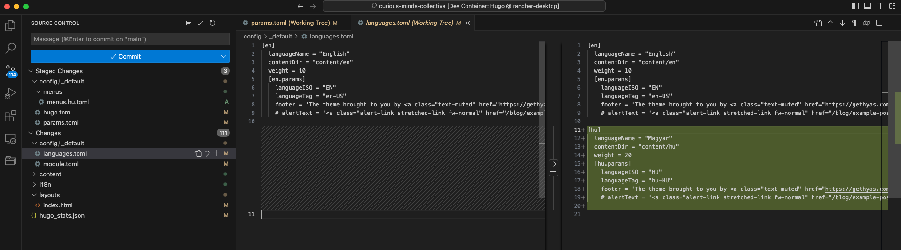

És itt jön a mókás dolog. Ez nem működött. Mivel a kód modul mountokat használ. Na de erről nem találtam egyből infót :) Szóval a mappákat külön kell mountolni.

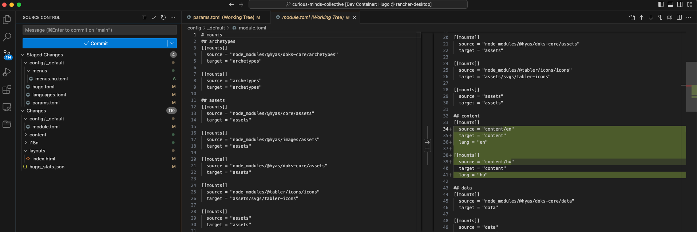

Ezekkel a beállításokkal az oldal egyelőre törni fog. De legalább látható lesz számotokra a commit history-ból.

## A tartalom át szervezése

Most már csak át kell alakítani a mappa szerkezetet. Minden ami eddig content volt mehet a `content/en` mappába.

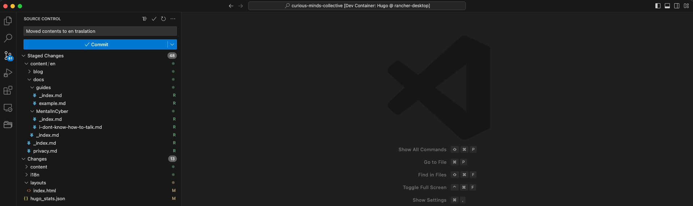

Hogy lesz ebből magyar tartalom? Elsőnek létrehoztam egy `content/hu` mappát és belemásoltam mindent ami az angol változatban benne van.

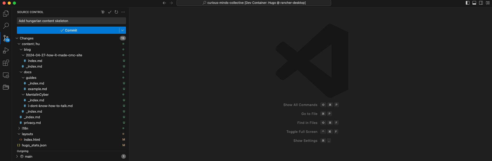

Már csak egyes elemek "magyarosítása" van hátra. Erre a `i18n` mappa tartalma szolgál segítségül.

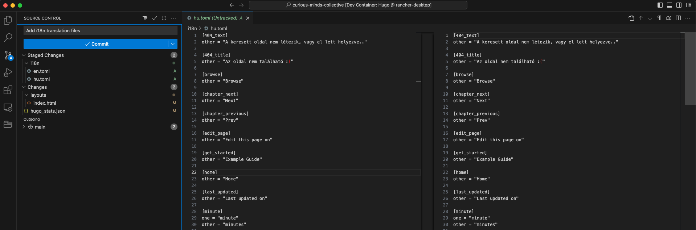

De valami nem stimmel még így sem. A fő oldal teljesen üres, ha magyarra váltok.

Angol:

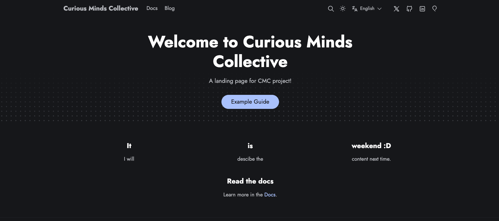

Magyar:

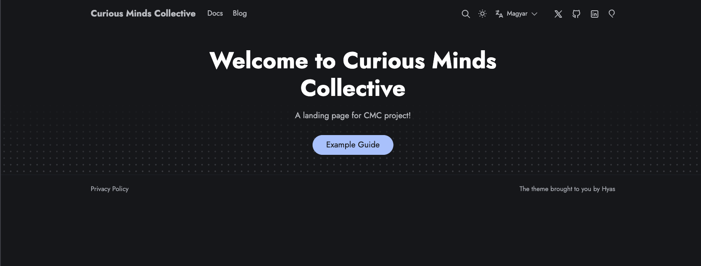

Sajnos ezt a rész nem a tartalomból van kitöltve, hanem bele van égetve a front page kódjába. Így ott kellett hozzáadnom egyelőre ezt a részt.

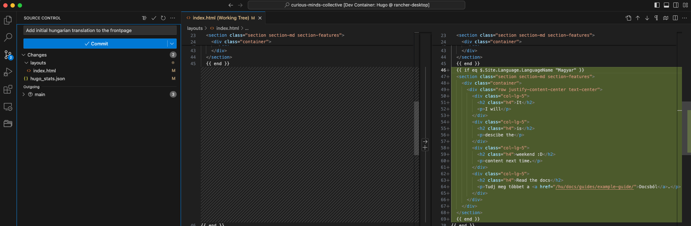

## Build failed

Ami megy lokálisan az nem biztos, hogy működik deploy után. Ki gondolná nem?

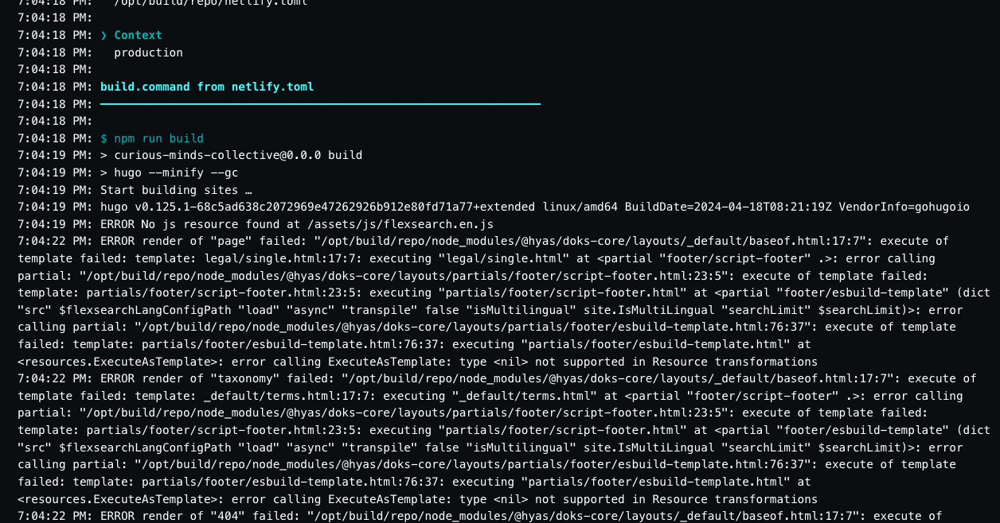

Számtalan kommit, kód túrás és jó szakmunkás kifejezések után rájöttem, hogy Netlify-on nem jönnek létre a többnyelvűsítéshez szükséges js fájlok.

Így legegyszerűbb megoldásként elegendő volt átmásolni a `node_modules/@hyas/doks-core/assets/js/flexsearch.js` fájlt a `assets/js/flexsearch.en.js`-ra és minden egyébb nyelvre, amit használni szerettem volna.

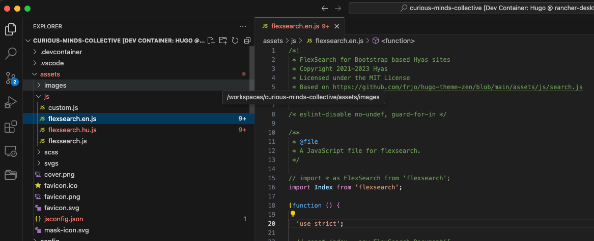

TODO: Open the Github issue

Ezek után már sikeres volt az oldal buildje és most már több nyelven is elérhető a tartalom. (Már csak helyesen írni kellene meg tanulni... viszont ez már máskérdés.)
